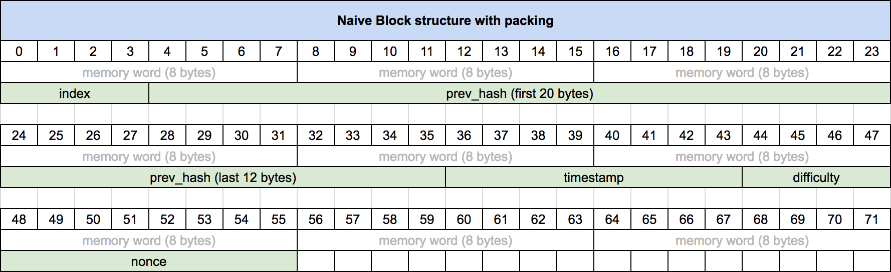
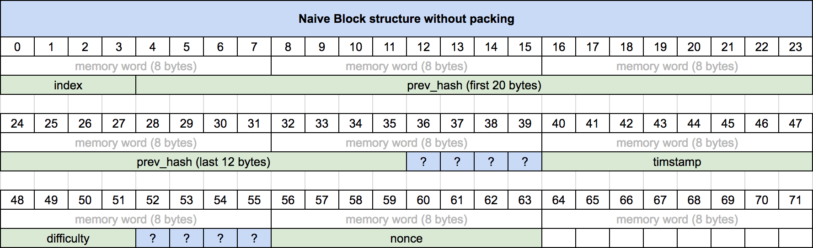
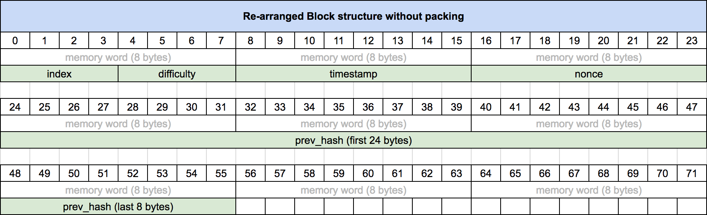
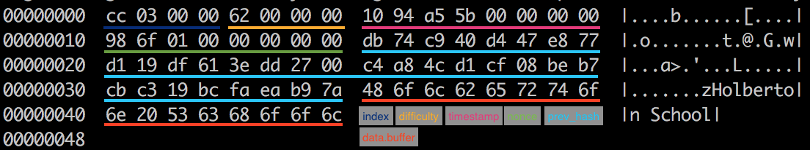

<h1 align="center"> Blockchain - Data structures</h1>

### Introduction
It is time for us to implement our Blockchain. This concept page has for goal to break down the different data structure we are going to use to implement our Blockchain in C.

### Blockchain
Here is the `first iteration` of the Blockchain structure we are going to use:

```
/**
 * struct blockchain_s - Blockchain structure
 *
 * @chain: Linked list of pointers to block_t
 */
typedef struct blockchain_s
{
    llist_t     *chain;
} blockchain_t;

```

This is pretty self-explanatory. For now, our Blockchain only consists of a list of Blocks. this list is implemented using the [Linked list library](https://github.com/hs-hq/holbertonschool-blockchain/tree/main/llist) provided to you for this project.

## Block

Here is the first iteration of the Block structure we are going to use:

```
/**
 * struct block_s - Block structure
 *
 * @info: Block info
 * @data: Block data
 * @hash: 256-bit digest of the Block, to ensure authenticity
 */
typedef struct block_s
{
    block_info_t    info; /* This must stay first */
    block_data_t    data; /* This must stay second */
    uint8_t     hash[SHA256_DIGEST_LENGTH];
} block_t;
```
As you can see, a Block contains three distinct parts:

* `info` stores the information about the Block (see `Block Info` later)
* `data` stores the user-defined data
* `hash`will contain a digest of both the Block info and data

### Block Info

Here is the Block Info structure we are going to use:

```
/**
 * struct block_info_s - Block info structure
 *
 * @index:      Index of the Block in the Blockchain
 * @difficulty: Difficulty of proof of work (hash leading zero bits)
 * @timestamp:  Time the Block was created at (UNIX timestamp)
 * @nonce:      Salt value used to alter the Block hash
 * @prev_hash:  Hash of the previous Block in the Blockchain
 */
typedef struct block_info_s
{
    /*
     * The order of the elements in this structure should remain the same.
     * It was designed so every element of this structure is aligned and
     * doesn't require padding from the compiler.
     * Therefore, it is possible to use the structure as an array of char,
     * on any architecture.
     */
    uint32_t    index;
    uint32_t    difficulty;
    uint64_t    timestamp;
    uint64_t    nonce;
    uint8_t     prev_hash[SHA256_DIGEST_LENGTH];
} block_info_t;

```

This structure contains information about the Block, which is why it is separated from its content. Let’s break it down:

* `index` stores the index of the Block inside the Blockchain. This index starts at 0.
* `difficulty` stores the difficulty at which the Block has been mined. Block mining will be discussed later, so we won’t be playing with this value for now.
* `timestamp` stores the [UNIX timestamp](https://www.unixtimestamp.com/) at which the Block was created.
* `nonce` stores an arbitrary value used to alter the Block `hash`. Again, we will discuss that later when we’ll talk about Block mining.
* `prev_hash` stores the `hash` of the previous Block in the Blockchain. the only exception is for the first Block in the chain, and we will discuss that in a little bit.

### Block Data

Here is the Block Data structure we are going to use:

```
#define BLOCKCHAIN_DATA_MAX 1024

/**
 * struct block_data_s - Block data
 *
 * @buffer: Data buffer
 * @len:    Data size (in bytes)
 */
typedef struct block_data_s
{
    /*
     * @buffer must stay first, so we can directly use the structure as
     * an array of char
     */
    int8_t      buffer[BLOCKCHAIN_DATA_MAX];
    uint32_t    len;
} block_data_t;
```


Again, pretty self-explanatory. this structure contains a buffer with a maximum size defined by **BLOCKCHAIN_DATA_MAX**. The element `len` represents the actual number of bytes of data stored in `buffer`, if it is smaller than the maximum size.

### Structure size and alignment

### stdint.h

During this project, we are going to use the è typedefs to declare most of our basic data types. For example, instead of declaring an `int`, we will prefer to declare an `int32_t`. This is to maintain the same size depending on the system architecture our code will be executed on. the `stdint.h` defines the different types, so it will always be the same size, no matter the architecture.

This is going to be very important for compatibility of our Blockchain. If for example we want a Block’s timstamp to be stored on 32 bits when serialized or exchange through a socket, it makes it very simple and reliable to use an `uint32_t` instead of an `unsigned int`, the size of the latter depending on the architecture.

### Structure alignment and padding
As you may have seen in the structure definition, it is said that the structures were designed so every element is aligned and therefore doesn’t require padding from the compiler.

We are not going to cover everything about memory alignment and padding. There are a lot of resources on the internet if you want to learn about it. I encourage you to read at least [this article](http://www.catb.org/esr/structure-packing/).

Now, why do we have to worry about memory alignment and structure padding? Having all the elements of our structs contiguous in memory will allow us to use our struct directly as an array of bytes, and this will be very useful to hash Blocks \o/

But we could **pack** our structure and we wouldn’t have to worry about padding? Yes .. Yes we could. But, ugh, we’re better than that. :) Plus, unaligned stuctures are slowing down your CPU. And that’s not cool.

This picture shows how a naive arrangment of our **block_info_t** structure would be stored in memory when it is packed (using the GCC attribute `__attribute__((__packed__))`):





But, packing should be avoided, so here is the same naive arrangment, with GCC padding applied:





Now, here is the arrangment we are going to use, without even needing to pack it, no padding is required:





### Block hash
In order to compute a hash of a Block, we need to identify the information to be hashed.

* Information to hash:
    * 4 bytes -> `info.index`
    * 4 bytes -> `info.difficulty`
    * 8 bytes -> `info.nonce`
    * 8 bytes -> `info.timestamp`
    * 32 bytes -> `info.prev_hash`
    * `data.len` bytes -> `data.buffer`

Of course we are not going to include the Block’s hash in itself, it wouldn’t make any sense.

### Example
Let’s consider the following Block:

```
block_t test = {
    { /* info */
        972 /* index */,
        98, /* difficulty */
        1537578000, /* timestamp */
        94104, /* nonce */
        "\xdb\x74\xc9\x40\xd4\x47\xe8\x77\xd1\x19\xdf\x61\x3e\xdd\x27\x00\xc4\xa8\x4c\xd1\xcf\x08\xbe\xb7\xcb\xc3\x19\xbc\xfa\xea\xb9\x7a" /* prev_hash */
    },
    { /* data */
        "Holberton School", /* buffer */
        16 /* len */
    },
    {0} /* hash */
};

```
Remember when we took the time to arrange our structure so it doesn’t need any padding from the compiler? How do you think we can hash this Block, without having to store everything in a buffer that we would then hash ..?

Here is the hexdump of the data that will be hashed:



And if you hash this … TADA !!

```
8c222661347f98250457298070eddd68f564ebc0829111041672e8650c61ff71
```
