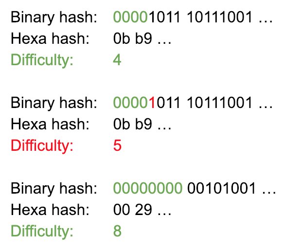

<h1 align="center">[EYNTK] Blockchain - Block mining</h1>

### Introduction
In this project, we are going to implement the mining process to our Blockchain. Right now, our Blockchain allows anyone to add a Block to it, without a cost, by simply creating one and hashing it.

### Proof-of-work
**“Mining a Block”** refers to the process of solving a computational puzzle, by trying a maximum of solutions. Only once this puzzle is solved a Block can be added to the Blockchain. The proof that the puzzle has been solved resides in the Block hash itself, and is known as the **“Proof of work”**.

The proof of work brings both balance and security to a Blockchain. It allows the Blockchain to automatically regulate how often a Block should be added to the chain. This can be done by modifying the difficulty of the puzzle. If Blocks are added too often, the difficulty will increase and vice versa. It also gives potential hackers a huge amount of computationnal work, if they wanted to alter the Blockchain. In fact, if someone alters a Block, this person would have to mine this Block again, as well as all the following Blocks in the Blockchain.

### Computational puzzle?!
The computational puzzle one has to solve in order to insert a Block in a Blockchain, is not some mysterious enigma, read to you by an old wizard. In fact, it is actually much simpler. If one wants to mine a Block, this person has to find a hash for this Block that matches some requirements.

But, wait… we use SHA256 to compute a Block hash, and this algorithm is deterministic. How could one “find” a valid hash, if the hash should be a unique identifier for our Block? Very good question, and the answer is the `nonce`. We are going to use this variable to alter the content of our Block, so its hash can change. The nonce can be any value, and it does not have to fulfill any requirement.

Now that we know we can safely alter the content of a Block in order to change its hash, how do we solve the puzzle? Well, the answer is brut force.

### Brut force?!
Yes, brut force. But, when you think about it, it is the only way, and it scales!

The way a hash works is that if you hash `A`, you get `B`, but it is mathematically **impossible** from `B`, to find the original value `A`. The only solution to do that is to try every single possible value for `A`, until one is found to give `B`. And even here, it doesn’t mean this value was the original, it might be a collision.

The computational puzzle one has to “solve” to insert a Block in a Blockchain is based on this principle. Again, one has to find a hash for the Block they want to insert, that matches some given requirements. (We’ll discuss these requirements just after). Now, we know what our Block hash should look like (`B`), but even knowing that, it is impossible for us to find the good value for our `nonce` (`A`) to get such a hash. So all we have to do, is try a lot of possibilties, one by one: brut force.

### The PoW resides in the hash
The diffifulty of a Block represents the number of leading `0` bits in its hash. A Block hash is simply an array of bytes, and we want the first `x` bits to be 0, in order to validate the puzzle, `x` being the difficulty of the puzzle.

### Conclusion
In this concept page, we clarified that “a computational puzzle” was simply another wording for “finding a hash that has enough leading zeros”. :)

Good luck for your project !
